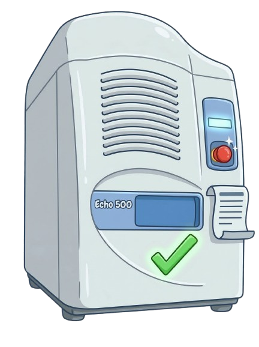

# Echo Print Check

<div style="display: flex; align-items: center;">
  
  <p>
    This script processes <code>.xml</code> files generated by the Echo 550 liquid handler, searching for skipped wells where transfers were unsuccessful. It generates <code>.csv</code> files listing only the missing wells, which can be used to re-run the process and transfer the required volumes.
  </p>
</div>

## Features

- Reads Echo 550 `.xml` files containing print results.
- Identifies skipped wells for a given plate barcode (source or destination).
- Only analyze files created in less than 1 day to ensure only recent runs are checked. 
  - Modify the condition `dif_time.days < 1` in the code if you want to check files created in a different time frame. 
- Outputs `.csv` files with missing wells for re-processing.

## Requirements

- Python 3.6+
- Standard libraries: `os`, `sys`, `operator`, `csv`, `datetime`, `xml.dom.minidom`, `xml.etree.ElementTree`
- `config.ini` file with input and output directory paths

## Installation

### Python (macOS/Ubuntu/Windows)

1. Install Python 3.6+ and pip if not already installed.
2. Clone the repository:
   ```bash
   git clone https://github.com/frba/Echo_print_check.git
   cd Echo_print_check
   ```
3. (Optional) Create a virtual environment:
   ```bash
   python -m venv venv
   source venv/bin/activate  # On Windows: venv\Scripts\activate
   ```
4. Install dependencies (if any additional packages are needed):
   ```bash
   pip install -r requirements.txt
   ```
### Windows Executable
1. Download the latest `echo_print_check.exe` from the [GitHub Releases page](https://github.com/frba/Echo_print_check/releases).
      
## Configuration

Set on `config.ini`:
1. Define on `input_dir` the path for your Echo `.xml` files.
2. Define on `output_dir` the path for the `.csv` files with skipped wells.

## Usage

### macOS/Ubuntu (Python)
Run the script from the command line:
   ```bash
   python main.py <source_or_destination> <barcode>
   ```
#### Example usage:
   Search for skipped wells in the source plate with barcode `ABC123`:
   ```bash
    python main.py 0 ABC123
   ```

### Windows (Executable)
Run the executable from the command line:
   ```bash
    .\echo_print_check.exe <source_or_destination> <barcode>
   ```
#### Example usage:
   Search for skipped wells in the destination plate with barcode `XYZ789`:
   ```bash
    .\echo_print_check.exe 1 XYZ789
   ```

## Output

Each `.csv` file contains:
- File name
- Source barcode
- Source well
- Destination barcode
- Destination well
- Actual volume transferred
- Volume transferred

These files can be used to re-run the Echo process for only the missing wells.